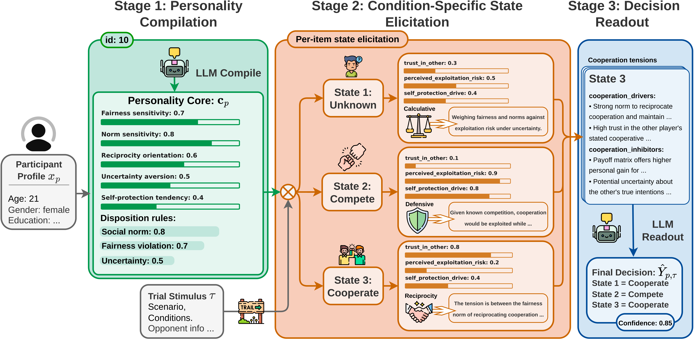

# Enhancing LLMs with Cognitive-Affective Personality Inference for Simulating Human Social-Psychological Behavior

Official repo of **Enhancing LLMs with Cognitive-Affective Personality Inference for Simulating Human Social-Psychological Behavior**, NeurIPS 2026.



## API configuration

Edit **`models`** in this directory: one entry per model with fields `endpoint`, `api_version` (use an empty string `""` for OpenAI-compatible endpoints), and `api_key`. Keys can also be overridden with environment variables such as `OPENAI_API_KEY` / `AZURE_OPENAI_API_KEY`.

For a **local** dotenv file, set **`SPIN_DOTENV_PATH`** to that file’s absolute path (do not commit the file or put real paths in shared READMEs). Evaluator debug file logging is off unless you set **`_DEBUG_EVAL_LOG=1`** and **`SPIN_DEBUG_LOG_PATH`**.

## Running experiments

In a conda environment with dependencies installed (default name `GTAgent`), run from this directory:

```bash
./run_spin.sh [STUDY_ID] [MODEL_NAME] [METHOD_NAME, default spin]
# Example: ./run_spin.sh S_T gpt-5.4-mini
```

The data directory defaults to **`data/`** (sibling of `models`). Set environment variable **`SPIN_DATA_DIR`** to a root that contains `registry.json` and `studies/` if you use a different layout.

## Where results go

Logs and artifacts are written under **`SPIN/results/<method>/<run_name>/`** (for example under the repo root; `run_spin.sh` prints the exact path when it runs).

## Citing

If you find this work useful in your research, please consider citing our paper:

```bibtex
@inproceedings{deng2026enhancing,
  title     = {Enhancing LLMs with Cognitive-Affective Personality Inference for Simulating Human Social-Psychological Behavior},
  author    = {Deng, Zhibo and Li, Dongyuan and Ge, Shuwen and Zhang, Ziqing and Zhang, Ying and Jiang, Renhe},
  booktitle = {Advances in Neural Information Processing Systems (NeurIPS)},
  year      = {2026}
}
```
